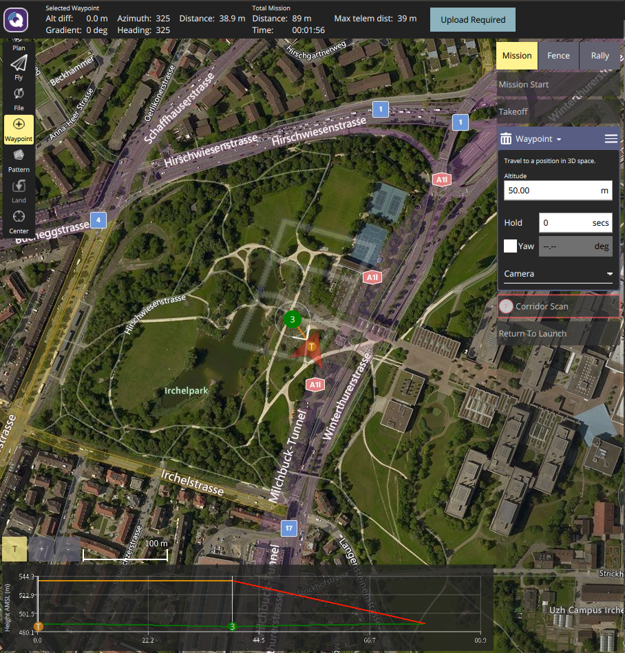

# neor_mini.urdf Runnig in PX4-Autopilot


## Part One: Installation

#### Step 1: Install PX4-Autopilot

```bash
# open a Terminal
mkdir catkin_ws
cd catkin_ws
git clone https://github.com/PX4/PX4-Autopilot.git --recursive
```

#### Step 2: Download dependence by scripts

```bash
# open a Terminal
cd ~/catkin_ws/
bash ./PX4-Autopilot/Tools/setup/ubuntu.sh              
sudo apt-get update
sudo apt-get upgrade
```

#### Step 3: Make and Run

Please enable your computer connect with the Internet.

```bash
cd catkin_ws/PX4-Autopilot/
make px4_sitl_default gazebo_rover
```


**Congratulations,the installation was successful.**


## Part two: Replace the rover model

#### Step 1: Download neor_mini_STIL_gazebo

```bash
git clone https://github.com/COONEO/neor_mini_SITL_gazebo.git
```

look like this:


#### Step 2:Replace rover model

​	Replace rover under ......../sitl_gazebo/Models folder with rover under **neor_mini_rover_model** folder


#### Step 3: Run new rover model 

Please enable your computer connect with the Internet.

```bash
# open a Terminal
cd catkin_ws/PX4-Autopilot
make px4_sitl_default gazebo_rover
```


**Congratulations,the replacement is successful.**


## Part three: Automatic driving by QGroundControl

#### Step 1: Run new rover 

Please enable your computer connect with the Internet.

```bash
# open a Terminal
cd catkin_ws/PX4-Autopilot
make px4_sitl_default gazebo_rover
```

continue with step 2.

#### Step 2: Run QGroundControl.AppImage

```bash
cd <your_path>/neor_mini_SITL_gazebo/neor_mini_rover_model/
sudo chmod +x QGroundControl.AppImage
./QGroundControl.AppImage
```


continue with step 3.

#### Step 3: Setup QGC to let new rover model can GPS trajectory tracking

​	· cleck the top left corner of QGC,then select right airframe


then apply your setting.

​	· drawing a GPS trajectory path by your hand and upload.



​	· Start automatic driving

cleck action and slide the bottom button .


**Congratulations,the new rover can running.**


2021.04.15

 author:ZhaoXiang Lee

COONEO Co.,Ltd

Web:[http://cooneo.cc](http://cooneo.cc/)

E: [cooneo@outlook.com](mailto:cooneo@outlook.com)

#neor_mini_SIT_gazebo

# neor_mini_SITL_gazebo
